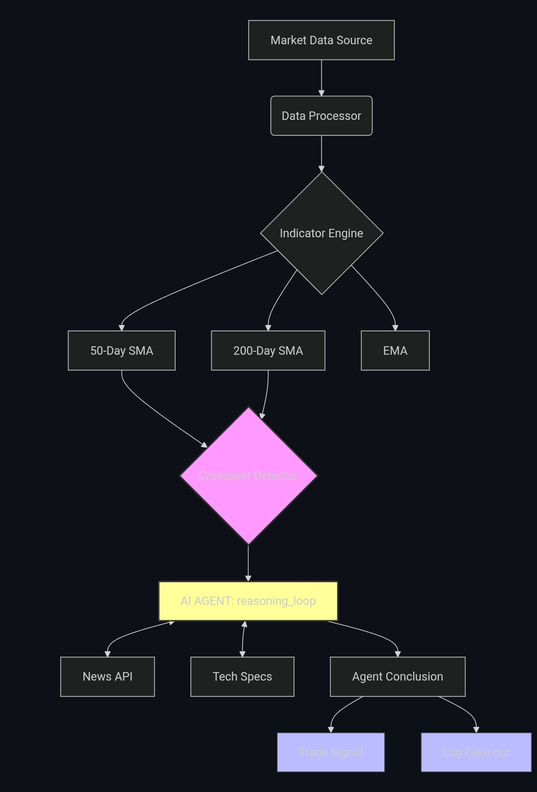

u# Kinetic-Alpha-Agentic-Technical-Analysis-Execution

Autonomous AI Agent for technical market analysis, utilizing ReAct prompting to validate SMA/EMA crossovers and 'Death Cross' signals across equities and crypto. 

The architectural framework of this software is licensed under the MIT License. All underlying proprietary mathematical models, indicator weights, and agentic reasoning architectures are the intellectual property of Michael M. Healy and are not covered under this license. Unauthorized commercial use of the proprietary logic or replication of the algorithmic decision-making process is strictly prohibited.

Autonomous AI Agent for technical market analysis...
​

🧠 Technical Deep Dive
While standard algorithms trigger on simple 50/200 SMA crossovers, Kinetic-Alpha uses a layered approach to minimize "whipsaw" trades (technical fake-outs).
1. Multimodal Indicator Validation
The system doesn't just look at the cross; it calculates the EMA (Exponential Moving Average) slope. If the 50-day SMA crosses the 200-day, but the short-term EMA slope is neutral, the agent flags it as a "Weak Signal" and waits for volume confirmation.
2. Agentic Reasoning Loop (ReAct)
When a Death Cross or Golden Cross is detected, the agent initiates a reasoning chain:
Contextual Analysis: It queries historical volatility during similar crossovers for the specific ticker (e.g., TSLA vs. GIS).
Strategy Matching: Based on the Greeks and current IV (Implied Volatility), it suggests an optimal structure—shifting from direct equity plays to Calendar Spreads or Covered Calls to capitalize on theta decay.
3. Built for Production
Asynchronous Processing: Built with Python's asyncio for real-time monitoring of multiple watchlists.
Modular Architecture: Easily swap out LLM providers or financial data APIs without refactoring the core indicator engine.
